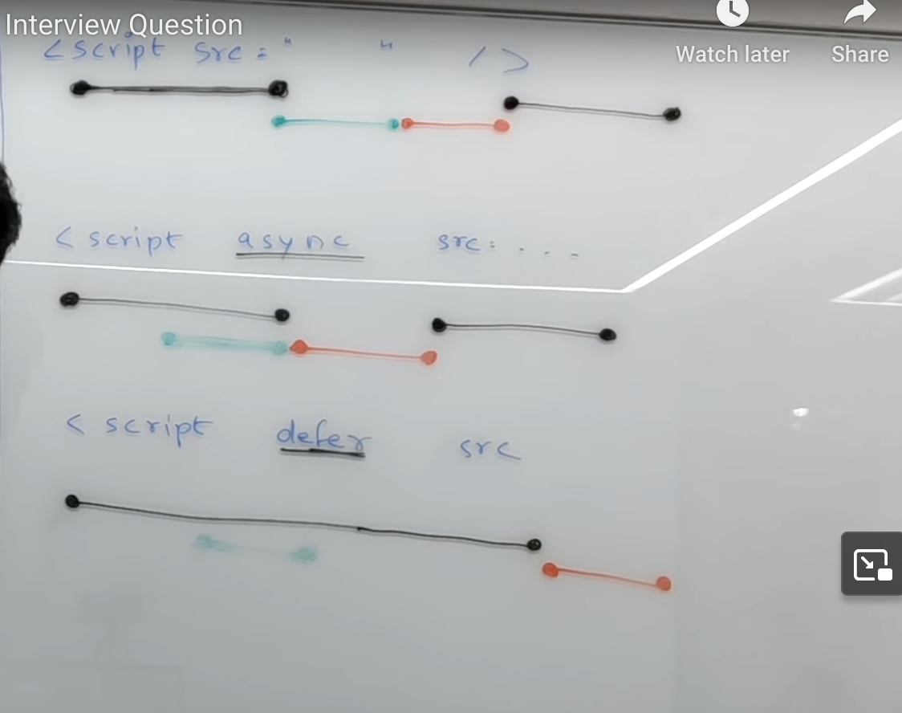

* 
- - Html parsing and script occer pause html parse and fetch script and exutue afeter resume parse

*  
    - html parse and script occerr continue pares and fetch script afeter pause html parse
    - execute script afeter resume html parse

* 
    - html parse and script occer fetch the script and complete the parse html after execute script.

    